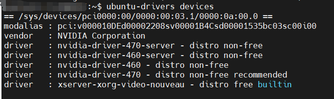
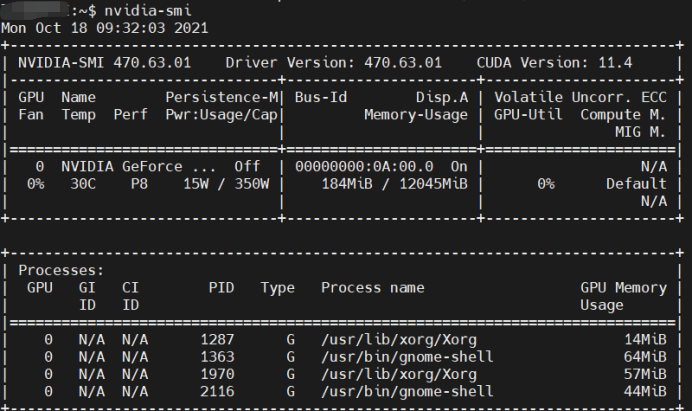
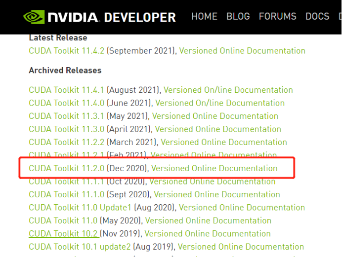
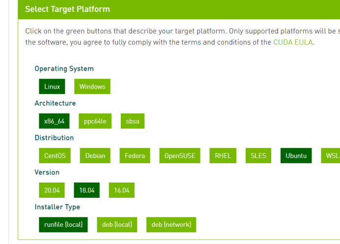
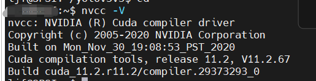
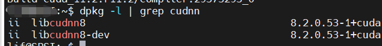
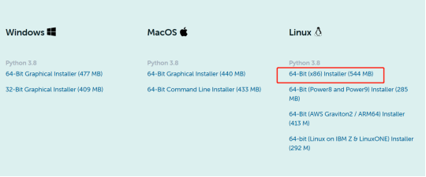
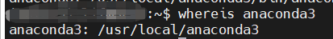

# 一次简单的服务器配置

## 写在前面

本篇记录仅做参考，各位读者具体问题具体分析哈。

## 0_目录

- [主机设备配置](#1_主机设备配置)
- [显卡驱动安装](#2_显卡驱动安装)
- [cuda安装](#3_cuda)
- [cudnn安装](#4_cudnn安装)
- [Anaconda环境的搭建](#5_Anaconda环境的搭建)
- [pytorch安装](#6_pytorch安装)

## 1_主机设备配置
- 操作系统：Ubuntu18.04
- 显卡：NVIDIA GeForce RTX 3080 Ti
- CUDA：11.2
- CUDNN：8.2.0
- Anaconda：2021.05-Linux-x86_64

## 2_显卡驱动安装
确定显卡驱动有没有安装上：`cat /proc/driver/nvidia/version`

没有反应则没有显卡驱动

查看主机显卡及推荐安装：`ubuntu-drivers devices`



随便选择一个推荐即可。博主这里选择安装470驱动：`sudo apt install nvidia-driver-470`

**_重启电脑_**，再次查看：nvidia-smi   

有如下反应则安装成功



**注：以上只是安装方式的一种，博主其他方式没有实际操作，若失败尝试禁用nouveau**

## 3_cuda安装
**上图来看**，推荐安装cuda11.4，这边建议安装`低一版本`的，博主安装的是cuda11.2

前往cuda官网 `https://developer.nvidia.com/cuda-toolkit-archive`

选择对应的cuda版本



选择符合自身设备的配置，选用 `runfile` 类型安装



然后就出现下载的命令：
```
wget https://developer.download.nvidia.com/compute/cuda/11.2.0/local_installers/cuda_11.2.0_460.27.04_linux.run
sudo sh cuda_11.2.0_460.27.04_linux.run
```

将上述命令在你的终端上执行。然后修改自己的环境变量：`sudo gedit ~/.bashrc`

在 `bashrc` 文件的最后添加：
```
export PATH=/usr/local/cuda-11.2/bin${PATH:+:${PATH}}
export LD_LIBRARY_PATH=/usr/local/cuda-11.2/lib64${LD_LIBRARY_PATH:+:${LD_LIBRARY_PATH}}
export CUDA_HOME=/usr/local/cuda-11.2
```

**保存退出，激活环境**：`source ~/.bashrc`

**验证cuda：** `nvcc -V`   出现下图，安装成功



## 4_cudnn安装

下载对应版本的 cudnn ：`https://developer.nvidia.com/cudnn`

里面还需注册什么的，文末给了 cudnn 的 [资源](#7_其他)

在官网上 下载 runtime 和 dev 包，（**两个都需要**）

将安装包移至服务器，依次安装 runtime 和 dev 包。

安装 runtime 包：`sudo dpkg -i libcudnn8_8.2.0.53-1+cuda11.3_amd64.deb`

安装 dev 包：`sudo dpkg -i libcudnn8-dev_8.2.0.53-1+cuda11.3_amd64.deb`

========================================================

**如果你的服务器仅安装一个 cuda 环境，下面操作可不做。**

找到 cudnn 和 libcudnn ：`whereis cudnn/libcudnn`

将他们复制到cuda11.2文件下，自行删除原文件：
```
sudo cp /usr/include/cudnn* /usr/local/cuda-11.2/include/
sudo cp /usr/lib/x86_64-linux-gnu/libcudnn* /usr/local/cuda-11.2/lib64/ -d
```

========================================================

验证cudnn：`dpkg -l | grep cudnn` ，如下显示则安装成功。



## 5_Anaconda环境的搭建

前往 anaconda 官网下载 Linux 版本的 sh 文件：`https://www.anaconda.com/products/individual#linux`



将下载的文件传至服务器，找到文件所在目录，开始安装：`bash ~/目录/package_name`

可选择 anaconda 的安装路径，博主路径为：



然后有个 `conda init` ，选择 `yes` ，在个人用户中就被添加了 anaconda 路径（好像有些版本要自己添加？）。

如果没有 `conda init` ，自行添加即可，修改环境变量：`sudo gedit ~/.bashrc`

在 `bashrc` 文件的最后添加：
```
export PATH=/路径/bin:$PATH
```

提高 anaconda3 文件夹的权限，可使每个用户都可操作：`sudo chmod 777 <file_name>`

个人用户可根据自身需求创建环境：`conda create -n <env_name> <python_version>`

若需进入终端则是目标环境，在 .bashrc 的末尾添加：
```
conda deactivate
conda activate  <env_name>
```

## 6_pytorch安装

**注意版本！！！注意版本！！！**

官网查阅符合cuda版本的pytorch，采取`镜像`安装方法，pip安装命令最后加上：`-i https://pypi.douban.com/simple`

可使用测试文件测试torch调用gpu是否顺利。

## 7_其他

### ①多版本cuda

若有读者需要其他版本的 cuda ，自行安装，注意 cuda 安装路径，注意 cudnn 安装路径，
将 cudnn 产生的文件移至对应 cuda 中，并删除原 cudnn 文件。

### ②资源链接

**百度云地址**
```
链接：https://pan.baidu.com/s/1jHdcNCr1s3Sp5pLyrVpgSQ 
提取码：307s 
--来自百度网盘超级会员V4的分享
```

### ③数据迁移

未来深度学习环境依赖包转移到其他硬盘，可参考 [这一博客](https://shliang.blog.csdn.net/article/details/106833121) ，博主并未实际操作。

